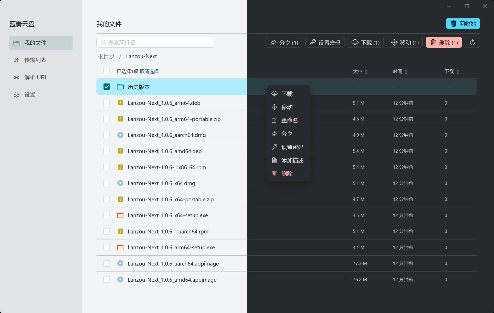
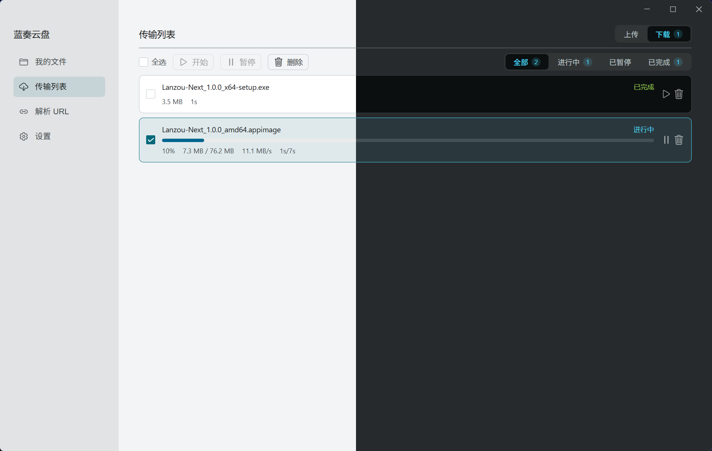
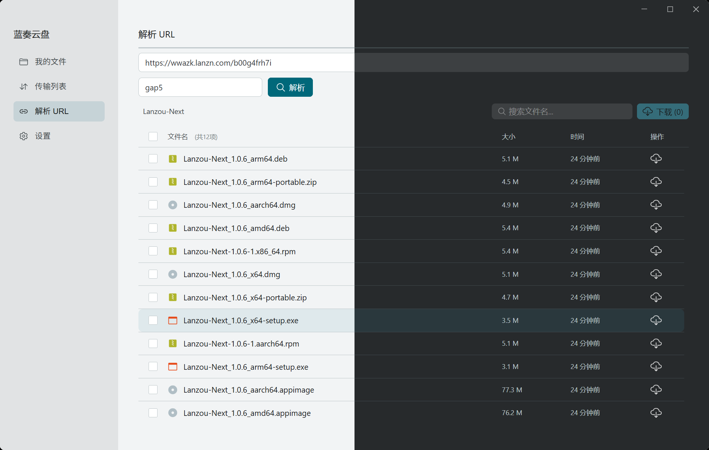
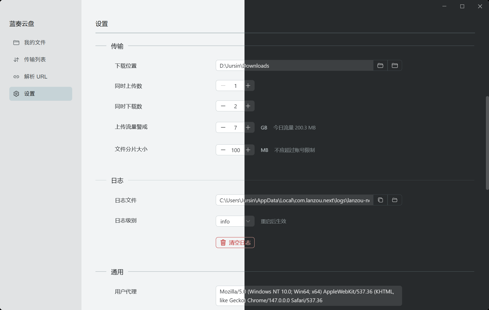

# Lanzou-Next


[](https://afdian.com/a/jursin)

一个轻量、美观的跨平台蓝奏云第三方客户端。

## 🖼️ 截图

|  |  |
| - | - |
|  |  |

## ✨ 功能特性

- **文件管理**：浏览、搜索、排序、重命名、移动、删除文件/文件夹
- **上传**：大文件自动分片上传、文件夹递归上传、上传预检
- **下载**：多线程断点续传、分片合并下载、自定义下载目录
- **分享解析**：解析分享链接、提取码自动填充
- **回收站**：查看、恢复、彻底删除
- **个性化**：预设配色方案、浅色/深色主题
- **账号管理**：账号密码登录、Cookie 自动持久化
- **更新检查**：启动时自动检查、手动检查、接收测试版更新、更新后自动安装并重启
- **日志查看**：实时记录日志、可选日志级别、一键清理

## ⚙️ 配置说明

配置文件位置（由 `tauri-plugin-store` 管理）：

| 平台 | 路径 |
|------|------|
| Windows | `%APPDATA%\com.lanzou.next\config.json` |
| Linux | `~/.config/com.lanzou.next/config.json` |
| macOS | `~/Library/Application Support/com.lanzou.next/config.json` |

## 📋 环境要求

- **Node.js**
- **pnpm**
- **Rust**

## 🚀 快速开始

```bash
# 克隆仓库
git clone https://github.com/Jursin/lanzou-next.git
cd lanzou-next

# 安装依赖
pnpm install

# 开发模式（热重载）
pnpm tauri dev

# 仅前端开发
pnpm dev
```

## 📦 构建发布包

```bash
# 前端类型检查 + 构建
pnpm build

# Windows NSIS 安装包
pnpm tauri build --bundles nsis

# Linux AppImage
pnpm tauri build --bundles appimage

# Linux .deb 包
pnpm tauri build --bundles deb

# Linux .rpm 包
pnpm tauri build --bundles rpm

# Linux .pkg.tar.zst 包
pnpm tauri build --no-bundle
cd pkg && makepkg -e --nocheck --skippgpcheck

# macOS .dmg
pnpm tauri build --bundles dmg
```

> [!warning]
> Arch Linux 构建 AppImage 前需先运行 `scripts/fix-linuxdeploy.sh`——Tauri 缓存的 linuxdeploy 内置 `strip` 版本过旧，无法识别新版 glibc 的 `.relr.dyn` 格式，会导致构建报错。脚本会下载最新版 linuxdeploy 到 `~/.cache/tauri/`。

## 📁 项目结构

```
lanzou-next/
├── src/                        # 前端 (Vue 3 + TS)
│   ├── assets/
│   │   └── icons/              # Material Icon SVG 文件
│   ├── components/
│   │   └── layout/             # 窗口控件、导航等布局组件
│   ├── composables/            # 组合式函数
│   ├── layouts/                # 页面布局
│   ├── router/                 # 路由
│   ├── shared/                 # 共享类型/常量/工具
│   ├── stores/                 # Pinia 状态
│   ├── styles/                 # 全局样式
│   ├── views/                  # 页面视图
│   ├── App.vue
│   └── main.ts
├── src-tauri/                  # 后端 (Rust)
│   ├── src/
│   │   ├── commands/           # Tauri 命令
│   │   │   ├── config.rs       # 配置管理
│   │   │   ├── lanzou.rs       # 文件/分享/目录操作
│   │   │   ├── login.rs        # 登录/登出
│   │   │   ├── log.rs          # 日志
│   │   │   ├── ops.rs          # 重命名/移动/权限/回收站
│   │   │   └── update.rs       # 更新检查与安装
│   │   ├── lanzou/
│   │   │   ├── client.rs       # HTTP 客户端（Cookie/UA/反爬）
│   │   │   ├── matcher.rs      # 正则/反爬解析
│   │   │   └── core/           # 核心业务逻辑
│   │   │       ├── download.rs # 下载
│   │   │       ├── upload.rs   # 上传
│   │   │       ├── merge.rs    # 分片合并
│   │   │       ├── share.rs    # 分享解析
│   │   │       ├── ls.rs       # 目录列表
│   │   │       ├── ops.rs      # 文件操作
│   │   │       ├── recycle.rs  # 回收站
│   │   │       ├── files.rs    # 文件详情
│   │   │       └── profile.rs  # 用户信息
│   │   ├── error.rs
│   │   ├── state.rs
│   │   ├── log_policy.rs
│   │   ├── main.rs
│   │   └── lib.rs
│   ├── build.rs
│   ├── tauri.conf.json
│   └── Cargo.toml
├── pkg/                        # Arch Linux 打包
│   └── PKGBUILD
├── scripts/
│   └── fix-linuxdeploy.sh
├── package.json
├── vite.config.ts
└── README.md
```

## 🛠️ 开发指南

### 代码规范

```bash
# 格式化
pnpm format                   # Prettier (前端)
cd src-tauri && cargo fmt     # rustfmt (后端)

# 类型检查
pnpm build                    # vue-tsc --noEmit + vite build

# Lint
pnpm lint                     # ESLint (前端)
cd src-tauri && cargo clippy  # Clippy (后端)
```

## 📜 许可证

[MIT License](LICENSE)

## 🙏 致谢

- 后端核心逻辑移植自 [chenhb23/lanzouyun-disk](https://github.com/chenhb23/lanzouyun-disk)
- 前端界面参考 [AnInsomniacy/motrix-next](https://github.com/AnInsomniacy/motrix-next)
- 蓝奏云接口逆向分析参考 [zaxtyson/LanZouCloud-API](https://github.com/zaxtyson/LanZouCloud-API)
- UI 组件库 [Naive UI](https://www.naiveui.com/)
- 桌面框架 [Tauri](https://tauri.app/)

## 📄 免责声明
本项目仅供个人学习和技术研究使用。
- **使用限制**：禁止将本项目用于任何违法行为，请遵守蓝奏云服务条款及相关法律法规。
- **责任声明**：你应了解相应的风险，因使用本项目产生的任何法律纠纷或损失，均由使用者自行承担。
- **争议处理**：如版权方认为本项目侵犯其权益，请通过 Issues 联系，我们将积极配合处理。